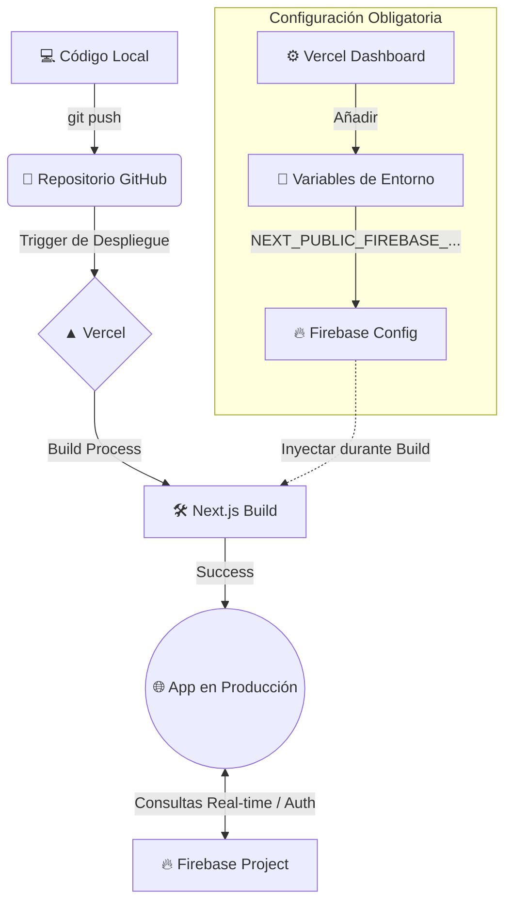

# 🚀 Cronoss Comments System - Prueba Técnica

Sistema de comentarios robusto, moderno y optimizado para Next.js 15, desarrollado como parte del proceso de selección para Frontend Developer @ Cronoss.


## 🌟 Características Principales

*   **⚡ Optimistic UI:** Los comentarios y eliminaciones se reflejan instantáneamente en la interfaz antes de confirmarse en el servidor.
*   **💬 Respuestas Anidadas:** Soporte para hilos de conversación (replies).
*   **🔐 Autenticación Robusta:** Sistema completo de Login/Registro con NextAuth.js v5 integrado con Firebase Auth y Firestore.
*   **🎨 UI Moderna:** Diseño limpio estilo "Glassmorphism" con CSS Modules, totalmente responsivo.
*   **🛡️ Validación Estricta:** Formularios validados con **Zod** y **React Hook Form**.
*   **🔄 Manejo de Estados:** Gestión eficiente de carga, error y reintentos con **TanStack Query**.

## 🛠️ Tecnologías

| Tecnología | Propósito |
| :--- | :--- |
| **Next.js 15 (App Router)** | Framework principal (React Server Components, Server Actions). |
| **Firebase (Firestore + Auth)** | Base de datos en tiempo real y autenticación persistente. |
| **TanStack Query (React Query)** | Gestión de estado asíncrono, caché y optimistic updates. |
| **Zod + React Hook Form** | Validación de esquemas y manejo de formularios. |
| **Vitest** | Tests unitarios para utilidades y esquemas de validación. |
| **Playwright** | Tests End-to-End (E2E) para flujos críticos de usuario. |
| **CSS Modules** | Estilizado modular y scoped. |

## 🚀 Instalación y Ejecución

1.  **Clonar el repositorio:**
    ```bash
    git clone https://github.com/tu-usuario/cronoss-comments.git
    cd cronoss-comments
    ```

2.  **Instalar dependencias:**
    ```bash
    npm install
    ```

3.  **Configurar Variables de Entorno:**
    Crea un archivo `.env.local` en la raíz con tus credenciales de Firebase:
    ```env
    NEXT_PUBLIC_FIREBASE_API_KEY=...
    NEXT_PUBLIC_FIREBASE_AUTH_DOMAIN=...
    NEXT_PUBLIC_FIREBASE_PROJECT_ID=...
    NEXT_PUBLIC_FIREBASE_STORAGE_BUCKET=...
    NEXT_PUBLIC_FIREBASE_MESSAGING_SENDER_ID=...
    NEXT_PUBLIC_FIREBASE_APP_ID=...
    AUTH_SECRET=...
    ```

4.  **Ejecutar en desarrollo:**
    ```bash
    npm run dev
    ```
    Abre [http://localhost:3000](http://localhost:3000) en tu navegador.

## 🧪 Ejecución de Tests

*   **Tests Unitarios (Vitest):** Validaciones de lógica y esquemas.
    ```bash
    npm run test
    ```

*   **Tests E2E (Playwright):** Validación visual y de flujos de usuario.
    ```bash
    npx playwright test --ui
    ```

## 🧠 Decisiones Técnicas

### ¿Por qué Firebase en lugar de Supabase?
Aunque la prueba mencionaba Supabase como bonus, opté por **Firebase** por la robustez de su integración con **NextAuth** y la familiaridad con su SDK de cliente para actualizaciones en tiempo real (aunque aquí usamos Server Actions para alinearnos con Next.js moderno). La estructura NoSQL de Firestore se adapta perfectamente a un sistema de comentarios anidados o planos.

### ¿Por qué TanStack Query con Next.js 15?
A pesar de que Next.js tiene su propio caché, **TanStack Query** sigue siendo superior para manejar estados de "Optimistic UI" complejos (rollback si falla, actualización inmediata de caché local) y para reintentos automáticos/manuales de peticiones fallidas, mejorando drásticamente la UX.

### Arquitectura de Componentes
Se optó por una arquitectura **Atomic Design** simplificada:
*   `ui/`: Botones, Inputs, Avatares (componentes puros).
*   `social/`: Componentes de negocio (CommentItem, CommentForm).
*   `hooks/`: Lógica separada de la UI (useAddComment, useCommentTree).

## ☁️ Despliegue

El despliegue está optimizado para **Vercel** (Zero-config).



1. Sube tu código a GitHub.
2. Importa el repositorio en Vercel.
3. **Crucial:** Agrega las variables de entorno de Firebase en el panel de configuración del proyecto en Vercel.
4. ¡Listo! Vercel detectará Next.js y desplegará automáticamente.

## 🔮 Qué mejoraría con más tiempo

1.  **Virtualización:** Si el post tiene 1000 comentarios, renderizarlos todos impactaría el rendimiento. Implementaría `react-window` o paginación infinita real.
2.  **Markdown/Rich Text:** Permitir negritas, enlaces o menciones en los comentarios.
3.  **SSR más agresivo:** Actualmente hidratamos el estado en el cliente con React Query. Podríamos pre-popular la caché desde el servidor (Hydration Boundary) para que el HTML inicial ya venga con los comentarios renderizados (SEO friendly).
4.  **Tests de Integración:** Añadir tests que simulen la interacción con Firebase usando emuladores locales.

---
**Desarrollado con ❤️ para Cronoss.**
